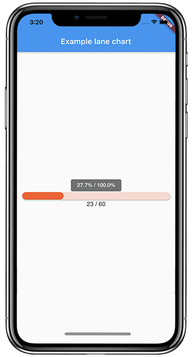

# Simple lane chart
## Compare charts
Comparing 2 charts between themselves.

 
```dart
Container(
     padding: EdgeInsets.symmetric(horizontal: 15),
     child: SimpleLaneChart(
     <firstValue>,
     <secondValue>,
     height: 20,
   ),
 ),
```
## Chart 100%
Comparing from 100%.

**Important** you should use parameter **"calFrom100Perc = true"**, and second value should be **total value**.

 
```dart
Container(
     padding: EdgeInsets.symmetric(horizontal: 15),
     child: SimpleLaneChart(
     <firstValue>,
     <totalValue>,
     calFrom100Perc: true,
     bgColor: Colors.deepOrange.withOpacity(0.3),
     color: Colors.deepOrange,
     height: 20,
   ),
 ),
```
